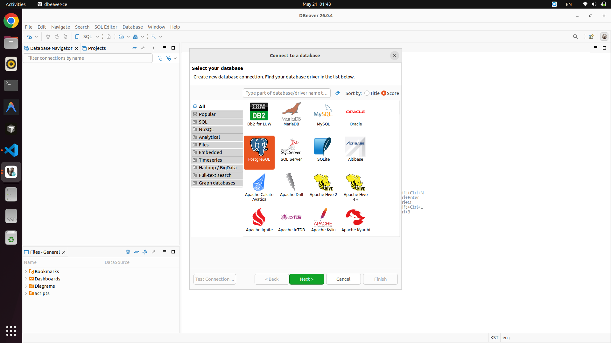
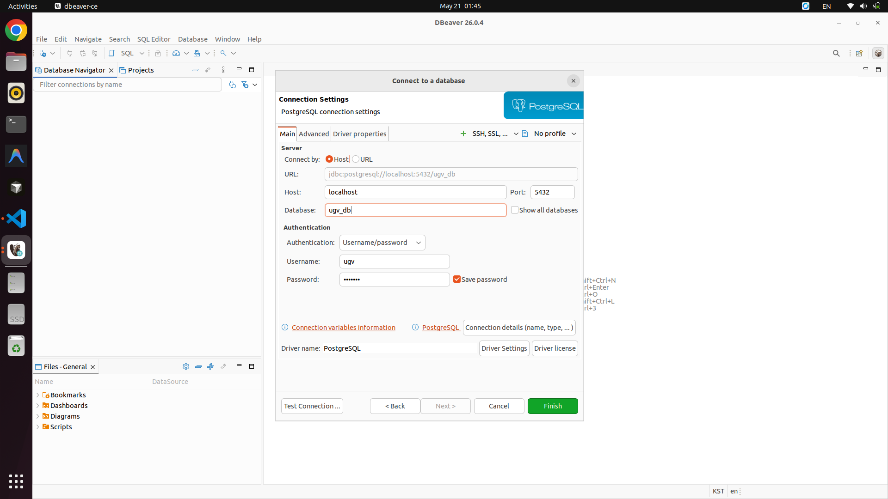
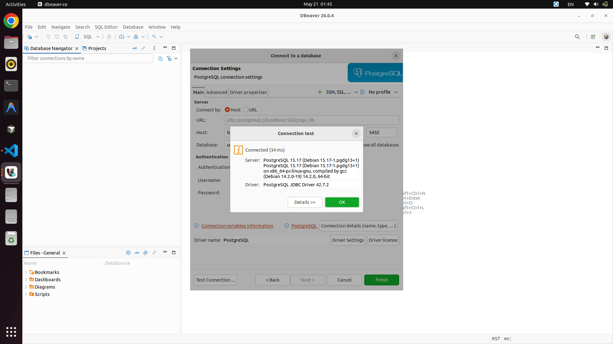

# CO-Paint-ugv
ROS2-based UGV system for the CO-Paint project, including navigation, control, and communication modules.

## 프로젝트 개요 (Project Overview)
현재 UGV와 드론을 통신 및 연결하여 페인트를 뿌리는 프로젝트를 진행 중입니다.

본 레포지토리는 UGV에 탑재되는 데스크톱용 레포지토리로, 프로젝트의 **메인 제어 서버**로 활용되며 동시에 **드론의 SLAM 처리**를 담당합니다.

### 시스템 구성 및 데이터 처리 체계
- **메인 데스크톱 / GCS (본 레포지토리 구동 PC)**: `192.168.53.5`, 전체 제어 서버 역할 및 드론 SLAM 작업 수행
- **보조 미니 PC**: `192.168.53.6`, UGV SLAM 작업 담당
- **드론 장착 라즈베리파이 (Raspberry Pi)**: `192.168.53.2`, 드론 내부 제어 통신
- **라이다(LiDAR) 센서**: 드론과 UGV에 각각 장착된 센서 데이터

위의 장치(PC, 통신 파이) 및 모든 라이다 센서는 UGV에 설치된 네트워크(공유기 등)를 통해 연결됩니다. 이렇게 취합된 데이터는 **본 레포지토리를 다운로드하여 실행 중인 메인 데스크톱**에서 최종 처리 및 제어됩니다.

### 주요 역할
- 메인 시스템 제어 (통신 서버)
- 드론 센서 데이터 수신 및 SLAM 처리
- ROS2 기반 경로 탐색(Navigation), 주행 제어(Control) 및 통신(Communication) 모듈 통합 구동

## Getting Started
### 1. Clone 전 Git 설정 (Windows 사용자 필수)

Windows 환경에서 클론하기 전에 아래 명령어를 먼저 실행하세요.
```bash
git config --global core.autocrlf input
```

> Windows는 Ubuntu와 달리 기본적으로 줄바꿈 문자를 CRLF로 변환하여 Docker 컨테이너나 Ubuntu에서 문제가 발생하는 것을 방지.


## Setting
새 PC 초기 세팅 절차를 완료된 이후 확인사항

### 0. 기준 네트워크 및 접속 주소
```text
GCS:                  192.168.53.5
Mini PC:              192.168.53.6
Raspberry Pi:         192.168.53.2
Subnet:               192.168.53.0/24
Web UI:               http://192.168.53.5
WebSocket proxy:      ws://192.168.53.5/rosbridge/
```

GCS PC는 `http://192.168.53.5` 혹은 `http://localhost`로 접속
외부 PC는 같은 `192.168.53.0/24` 라우터에 연결 후 `http://192.168.53.5`로 접속
WebSocket은 웹 서버의 `/rosbridge/` 경로에서 `ws://192.168.53.5/rosbridge/`로 확인

### 0-1. Network Traffic Flow


- 외부 브라우저는 GCS `80/tcp`의 `web_ui` nginx로 접속
- nginx는 `/api/` 요청을 `server:8000` FastAPI로 프록시
- nginx는 `/rosbridge/` 요청을 `co_paint:9090` rosbridge WebSocket으로 프록시
- `server`는 `postgres:5432`에 통신/텔레메트리 로그 저장
- ROS 2 DDS는 `20650-20800/udp`, Micro XRCE-DDS는 `8888/udp` 사용


### 1. Network test
전체 네트워크 테스트는 `10. 전체 네트워크 테스트`에서 실행
장치 ping, GCS Web UI, API 프록시, rosbridge WebSocket 프록시 함께 확인


### 2. PX4 1.16 의존성 준비
- MicroXrce-dds: https://github.com/eProsima/Micro-XRCE-DDS
- PX4 autopilot: https://github.com/PX4/PX4-Autopilot
- PX4 버전: 1.16 사용
- px4_msgs: `release/1.16` 빌드 후 source 실행


```bash
mkdir -p ~/px4_msgs_ws/src
cd ~/px4_msgs_ws/src
git clone -b release/1.16 https://github.com/PX4/px4_msgs.git
cd ~/px4_msgs_ws
colcon build
source ~/px4_msgs_ws/install/setup.bash
```


#### 2-1. Drone 직접 제어 실행
터미널 2개에서 통신 에이전트와 제어 GUI 노드를 순서대로 실행

**Terminal 1 (통신 에이전트 실행)**
```bash
MicroXRCEAgent udp4 -p 8888
```

**Terminal 2 (제어 GUI 노드 실행)**
```bash
cd ~/dev/projects/CO_Paint/ugv_system/control_code
source install/setup.bash
ros2 run px4_gui_ctrl gui_node
```


### 3. CycloneDDS / ROS 2 DDS / 방화벽 설정
Raspberry Pi로 `cyclonedds.xml` 복사, 장치별 IP 수정, `~/.bashrc` 설정, 방화벽 허용 순서로 실행

```bash
scp ~/dev/projects/CO_Paint/ugv_system/middleware/cyclonedds.xml samuel@192.168.53.2:/home/samuel/CO_Paint/CO-Paint-uav-edge/cyclonedds.xml

cd ~/CO_Paint/CO-Paint-uav-edge
ls -l cyclonedds.xml
nano ~/CO_Paint/CO-Paint-uav-edge/cyclonedds.xml
# scp 명령어 사용시 파일 전송받는 쪽 PC IP로 변경
# Raspberry Pi에서는 <NetworkInterfaceAddress>를 192.168.53.2로 수정
# Mini PC에서는 <NetworkInterfaceAddress>를 192.168.53.6으로 수정

# 설정 추가
nano ~/.bashrc

# ROS 2 Humble setup
source /opt/ros/humble/setup.bash

# CO-Paint ROS2 DDS settings
export ROS_DOMAIN_ID=53
export RMW_IMPLEMENTATION=rmw_cyclonedds_cpp
export CYCLONEDDS_URI=file:///home/samuel/CO_Paint/CO-Paint-uav-edge/cyclonedds.xml

# DDS 세팅 확인
printenv | grep -E "ROS_DOMAIN_ID|RMW_IMPLEMENTATION|CYCLONEDDS_URI"

# 방화벽 설정 - GCS PC에서 Web UI, rosbridge, API, PostgreSQL, DDS, Micro XRCE-DDS 포트 허용
sudo ufw allow 22/tcp
sudo ufw allow 80/tcp
sudo ufw allow 8000/tcp
sudo ufw allow 9090/tcp
sudo ufw allow 5432/tcp
sudo ufw allow 8888/udp

# 방화벽 설정 - 모든 ROS 2 DDS PC
sudo ufw allow in proto udp from 192.168.53.0/24 to any port 20650:20800
sudo ufw reload
sudo ufw status
```

`ufw`가 비활성화되어 있으면 활성화

```bash
cd ~
sudo ufw enable
sudo ufw status verbose
```

테스트 중 방화벽 영향인지 빠르게 확인해야 할 때만 임시로 off

```bash
cd ~
sudo ufw disable
sudo ufw status
```

운영 시 다시 on

```bash
cd ~
sudo ufw enable
```


### 4. DDS 통신 및 DB 저장 확인
#### 토픽 테스트
##### 데스크톱 (수신)
```bash
docker compose exec -T co_paint /bin/bash -lc "source /opt/ros/humble/setup.bash; ros2 daemon stop; ros2 daemon start"

docker compose exec -T co_paint /bin/bash -lc "source /opt/ros/humble/setup.bash; ros2 topic echo /copaint/net_test std_msgs/msg/String"
```

##### 라즈베리 파이
```bash
ros2 topic pub /copaint/net_test std_msgs/msg/String "{data: 'uav_edge_test_from_personal_minipc'}" -r 1
```


##### 데스크톱 (수신)
```bash
cd ~/dev/projects/CO_Paint/ugv_system

# px4_msgs 확인용
docker compose exec -T co_paint /bin/bash -lc "source /opt/ros/humble/setup.bash; source /workspace/install/local_setup.bash; ros2 interface show px4_msgs/msg/VehicleStatus"

# 토픽 테스트
docker compose exec -T co_paint /bin/bash -lc "source /opt/ros/humble/setup.bash; source /workspace/install/local_setup.bash; ros2 topic echo /copaint/px4_net_test px4_msgs/msg/VehicleStatus --qos-reliability best_effort"
```

##### 라즈베리 파이
```bash
source /opt/ros/humble/setup.bash
source ~/px4_msgs_ws/install/setup.bash  

ros2 topic pub -r 1 --qos-reliability best_effort \
  /copaint/px4_net_test \
  px4_msgs/msg/VehicleStatus \
  "{timestamp: 0, arming_state: 2, nav_state: 14, failsafe: false}"
```


##### 실패 시
```bash
WARNING: topic [/copaint/net_test] does not appear to be published yet
Could not determine the type for the passed topic
samuel@samuel3740:~/dev/projects/CO_Paint/ugv_system
```

`/copaint/net_test` 토픽 통신 테스트 결과는 `telemetry_logs`가 아니라 별도 테이블인 `topic_communication_test_logs`에 저장

`telemetry_logs`는 PX4 위치/상태 토픽(`/fmu/out/vehicle_local_position`, `/fmu/out/vehicle_status`) 기록용

**DB에서 최근 통신 테스트 로그 확인**
```bash
docker compose exec -T postgres psql -U ugv -d ugv_db -c "SELECT topic_test_log_id, received_at, topic_name, message_data, source_name FROM topic_communication_test_logs ORDER BY topic_test_log_id DESC LIMIT 10;"
```

**API로 최근 통신 테스트 로그 확인**
```bash
curl http://localhost:8000/api/topic-test-logs?limit=10
curl http://192.168.53.5/api/topic-test-logs?limit=10
```

**DBeaver에서 확인**

이 데스크톱에서 DBeaver로 접속할 때는 아래 값으로 PostgreSQL 연결을 생성

```text
Host: localhost
Port: 5432
Database: ugv_db
Username: ugv
Password: ugv1234
```

1. DBeaver에서 `New Database Connection` 선택 후 `PostgreSQL` 선택



2. 접속 정보를 입력하고 `Test Connection`으로 연결 확인



3. 연결 성공 후 `public -> Tables -> topic_communication_test_logs -> View Data`에서 저장 로그 확인



테스트용 publisher를 `-r 1`로 실행하면 1초마다 DB에 한 줄씩 저장. 테스트 완료 후 publisher 터미널에서 `Ctrl+C`로 종료

---


## 새 PC 초기 세팅 절차

아래 절차는 새 Ubuntu PC에 `ugv_system`을 처음 클론해서 GCS/Web UI 서버로 사용하는 경우를 기준으로 진행
기준 네트워크는 위 `0. 기준 네트워크 및 접속 주소` 참고

### 1. 기본 패키지 설치

새 PC에서 터미널을 열고 실행
it curl ca-certificates gnupg lsb-release iproute2 iputils-ping net-tools ufw 설치

```bash
cd ~
sudo apt update
sudo apt install -y git curl ca-certificates gnupg lsb-release iproute2 iputils-ping net-tools ufw
```


Docker 설치

```bash
cd ~
sudo install -m 0755 -d /etc/apt/keyrings
curl -fsSL https://download.docker.com/linux/ubuntu/gpg | sudo gpg --dearmor -o /etc/apt/keyrings/docker.gpg
sudo chmod a+r /etc/apt/keyrings/docker.gpg
echo \
  "deb [arch=$(dpkg --print-architecture) signed-by=/etc/apt/keyrings/docker.gpg] https://download.docker.com/linux/ubuntu \
  $(. /etc/os-release && echo "$VERSION_CODENAME") stable" | \
  sudo tee /etc/apt/sources.list.d/docker.list > /dev/null
sudo apt update
sudo apt install -y docker-ce docker-ce-cli containerd.io docker-buildx-plugin docker-compose-plugin
```


현재 사용자를 `docker` 그룹에 추가

```bash
cd ~
sudo usermod -aG docker "$USER"
newgrp docker
docker --version
docker compose version
```
`newgrp docker` 이후 Docker 권한 문제 발생 시 로그아웃 후 다시 로그인


### 2. 코드 클론

권장 경로: `~/dev/projects/CO_Paint/ugv_system`

```bash
cd ~
mkdir -p ~/dev/projects/CO_Paint
cd ~/dev/projects/CO_Paint
git clone <UGV_SYSTEM_REPOSITORY_URL> ugv_system
cd ~/dev/projects/CO_Paint/ugv_system
```


클론 후 파일 위치 확인

```bash
cd ~/dev/projects/CO_Paint/ugv_system
ls -la
ls -la docker-compose.yml middleware/cyclonedds.xml scripts/check_network.sh
```


### 3. 환경 파일 준비

`.env.example`을 복사해서 `.env` 생성

```bash
cd ~/dev/projects/CO_Paint/ugv_system
cp .env.example .env
nano .env
```


.env 확인

```bash
cd ~/dev/projects/CO_Paint/ugv_system
grep -E "GCS_IP|MINI_PC_IP|UAV_EDGE_IP|ROS_DOMAIN_ID|ROSBRIDGE_PORT|WEB_UI_PORT" .env
```


### 4. GCS 고정 IP 설정

현재 네트워크 인터페이스 이름 확인

```bash
cd ~
ip -br addr
nmcli device status
nmcli connection show
```


유선 인터페이스 연결 이름이 `Wired connection 1`이면 아래와 같이 설정

```bash
cd ~
sudo nmcli connection modify "Wired connection 1" \
  ipv4.addresses 192.168.53.5/24 \
  ipv4.gateway 192.168.53.1 \
  ipv4.dns "8.8.8.8 1.1.1.1" \
  ipv4.method manual

sudo nmcli connection down "Wired connection 1"
sudo nmcli connection up "Wired connection 1"
```


설정 확인:

```bash
cd ~
ip -br addr
ip route
ping -c 3 192.168.53.5
ping -c 3 192.168.53.1
```


#### 4-1. 고정 IP 변경 시 수정해야 하는 곳

GCS IP를 예를 들어 `192.168.53.5`으로 바꾸는 경우 아래 파일을 모두 수정

```bash
cd ~/dev/projects/CO_Paint/ugv_system
nano .env
nano .env.example
nano middleware/cyclonedds.xml
nano docker/web_ui/nginx.conf
nano README.md
```

`.env`:

```env
GCS_IP=192.168.53.5
```

`middleware/cyclonedds.xml`:

```xml
<NetworkInterfaceAddress>192.168.53.5</NetworkInterfaceAddress>
<Peer address="192.168.53.10"/>  <!-- Desktop PC / GCS -->
```

`docker/web_ui/nginx.conf`:

```nginx
server_name 192.168.53.5 localhost _;
```

NetworkManager 고정 IP도 함께 변경

```bash
cd ~
nmcli connection show
sudo nmcli connection modify "Wired connection 1" \
  ipv4.addresses 192.168.53.5/24 \
  ipv4.gateway 192.168.53.1 \
  ipv4.method manual
sudo nmcli connection down "Wired connection 1"
sudo nmcli connection up "Wired connection 1"
ip -br addr
```

설정 변경 후 컨테이너를 다시 빌드/재시작

```bash
cd ~/dev/projects/CO_Paint/ugv_system
docker compose up -d --build
docker compose ps
scripts/check_network.sh
```

#### 4-2. 무선 네트워크와 유선 Lan 동시 사용
각 네트워크 간 대역대를 다르게 하기
```bash
cd ~

# 현재 연결 확인
nmcli connection show --active
ip route

# 유선 LAN은 UGV/드론 내부망 전용으로 설정
sudo nmcli connection modify "Wired connection 1" \
  ipv4.addresses 192.168.53.5/24 \
  ipv4.method manual \
  ipv4.never-default yes

# Wi-Fi는 인터넷 기본 경로로 사용
sudo nmcli connection modify "<Wi-Fi 연결 이름>" \
  ipv4.method auto \
  ipv4.never-default no

# 연결 재시작
sudo nmcli connection down "Wired connection 1"
sudo nmcli connection up "Wired connection 1"

# 라우팅 확인
ip route
```


### 5. CycloneDDS 설정 확인

GCS PC는 `middleware/cyclonedds.xml`의 `NetworkInterfaceAddress`를 `192.168.53.5`로 유지

```bash
cd ~/dev/projects/CO_Paint/ugv_system
nano middleware/cyclonedds.xml
```


GCS 기준값:

```xml
<NetworkInterfaceAddress>192.168.53.5</NetworkInterfaceAddress>
```

Peers:

```xml
<Peer address="192.168.53.5"/>  <!-- Desktop PC / GCS -->
<Peer address="192.168.53.6"/>  <!-- Mini PC / UGV SLAM -->
<Peer address="192.168.53.2"/>  <!-- UAV edge / Raspberry Pi role -->
```


값 확인:

```bash
cd ~/dev/projects/CO_Paint/ugv_system
grep -n "NetworkInterfaceAddress\\|Peer address" middleware/cyclonedds.xml
```


### 6. CycloneDDS / ROS 2 DDS / 방화벽 설정
Raspberry Pi로 `cyclonedds.xml` 복사, 장치별 IP 수정, `~/.bashrc` 설정, 방화벽 허용 순서로 실행

```bash
scp ~/dev/projects/CO_Paint/ugv_system/middleware/cyclonedds.xml samuel@192.168.53.2:/home/samuel/CO_Paint/CO-Paint-uav-edge/cyclonedds.xml

cd ~/CO_Paint/CO-Paint-uav-edge
ls -l cyclonedds.xml
nano ~/CO_Paint/CO-Paint-uav-edge/cyclonedds.xml
# scp 명령어 사용시 파일 전송받는 쪽 PC IP로 변경
# Raspberry Pi에서는 <NetworkInterfaceAddress>를 192.168.53.2로 수정
# Mini PC에서는 <NetworkInterfaceAddress>를 192.168.53.6으로 수정

# 설정 추가
nano ~/.bashrc

# ROS 2 Humble setup
source /opt/ros/humble/setup.bash

# CO-Paint ROS2 DDS settings
export ROS_DOMAIN_ID=53
export RMW_IMPLEMENTATION=rmw_cyclonedds_cpp
export CYCLONEDDS_URI=file:///home/samuel/CO_Paint/CO-Paint-uav-edge/cyclonedds.xml

# DDS 세팅 확인
printenv | grep -E "ROS_DOMAIN_ID|RMW_IMPLEMENTATION|CYCLONEDDS_URI"

# 방화벽 설정 - GCS PC에서 Web UI, rosbridge, API, PostgreSQL, DDS, Micro XRCE-DDS 포트 허용
sudo ufw allow 22/tcp
sudo ufw allow 80/tcp
sudo ufw allow 8000/tcp
sudo ufw allow 9090/tcp
sudo ufw allow 5432/tcp
sudo ufw allow 8888/udp

# 방화벽 설정 - 모든 ROS 2 DDS PC
sudo ufw allow in proto udp from 192.168.53.0/24 to any port 20650:20800
sudo ufw reload
sudo ufw status
```


`ufw`가 비활성화되어 있으면 활성화

```bash
cd ~
sudo ufw enable
sudo ufw status verbose
```


테스트 중 방화벽 영향인지 빠르게 확인해야 할 때만 임시로 off

```bash
cd ~
sudo ufw disable
sudo ufw status
```


운영 시 다시 on

```bash
cd ~
sudo ufw enable
```


### 7. Docker 서비스 실행

처음 실행 또는 설정 변경 후 아래 명령으로 빌드/실행

```bash
cd ~/dev/projects/CO_Paint/ugv_system
docker compose up -d --build
```

상태 확인:

```bash
cd ~/dev/projects/CO_Paint/ugv_system
docker compose ps
```

정상 예시는 `co_paint`, `server`, `web_ui`, `postgres`가 모두 `Up` 상태
로그 확인:

```bash
cd ~/dev/projects/CO_Paint/ugv_system
docker compose logs --tail 80 co_paint
docker compose logs --tail 80 server
docker compose logs --tail 80 web_ui
```

rosbridge가 정상이라면 `co_paint` 로그에 아래와 비슷한 문구 출력


```text
Rosbridge WebSocket server started on port 9090
```


### 8. GCS 로컬 접속 확인

GCS PC에서 직접 확인

```bash
cd ~
curl http://localhost/
curl http://192.168.53.5/
curl "http://192.168.53.5/api/topic-test-logs?limit=1"
```


브라우저에서 확인:

```text
http://localhost
http://192.168.53.5
```


WebSocket 프록시 확인:

```bash
cd ~
curl --max-time 3 --include --no-buffer --http1.1 \
  --header "Connection: Upgrade" \
  --header "Upgrade: websocket" \
  --header "Sec-WebSocket-Key: SGVsbG8sIHdvcmxkIQ==" \
  --header "Sec-WebSocket-Version: 13" \
  http://192.168.53.5/rosbridge/
```


정상이면 아래 응답이 포함

```text
HTTP/1.1 101 Switching Protocols
```


### 9. 외부 PC 접속 확인

외부 PC가 같은 라우터의 `192.168.53.0/24` 대역인지 확인

Windows 외부 PC에서 IP 확인:

```powershell
ipconfig
```


외부 PC의 IPv4가 `192.168.53.x`인지 확인

Windows 외부 PC에서 GCS 연결 확인:

```powershell
ping 192.168.53.5
Test-NetConnection 192.168.53.5 -Port 80
Test-NetConnection 192.168.53.5 -Port 9090
```


외부 PC 브라우저 접속:

```text
http://192.168.53.5
```

`https://`가 아니라 반드시 `http://`로 접속. 페이지가 뜨는데 WebSocket만 `Connecting`이면 브라우저에서 `Ctrl+F5`로 강력 새로고침


### 10. 전체 네트워크 테스트

GCS PC에서 아래 스크립트를 실행

```bash
cd ~/dev/projects/CO_Paint/ugv_system
scripts/check_network.sh
```

이 스크립트가 확인하는 항목:

```text
192.168.53.5 GCS ping
192.168.53.6 Mini PC ping
192.168.53.2 Raspberry Pi ping
192.168.53.5:80 Web UI TCP
192.168.53.5:9090 rosbridge TCP
http://192.168.53.5/ Web UI HTTP
http://192.168.53.5/api/topic-test-logs?limit=1 API proxy
ws://192.168.53.5/rosbridge/ WebSocket upgrade
```

Mini PC 또는 Raspberry Pi가 꺼져 있으면 해당 ping만 실패할 수 있음
GCS Web UI/API/WebSocket 항목이 모두 OK면 웹 서버 쪽은 정상


### 12. 자주 발생하는 문제

`http://192.168.53.5` 접속이 안 되는 경우:

```bash
cd ~/dev/projects/CO_Paint/ugv_system
ip -br addr
ss -ltnp | grep -E ":80|:9090|:8000"
docker compose ps
docker compose logs --tail 80 web_ui
sudo ufw status verbose
```

WebSocket이 `Connecting`에서 멈추는 경우:

```bash
cd ~/dev/projects/CO_Paint/ugv_system
curl --max-time 3 --include --no-buffer --http1.1 \
  --header "Connection: Upgrade" \
  --header "Upgrade: websocket" \
  --header "Sec-WebSocket-Key: SGVsbG8sIHdvcmxkIQ==" \
  --header "Sec-WebSocket-Version: 13" \
  http://192.168.53.5/rosbridge/

docker compose logs --tail 80 co_paint
```

`co_paint` 로그에 `does not match an available interface`가 나오는 경우:

```bash
cd ~/dev/projects/CO_Paint/ugv_system
ip -br addr
grep -n "NetworkInterfaceAddress" middleware/cyclonedds.xml
```

현재 PC의 실제 IP와 `NetworkInterfaceAddress`가 다르면 `middleware/cyclonedds.xml`을 수정하고 재시작

```bash
cd ~/dev/projects/CO_Paint/ugv_system
nano middleware/cyclonedds.xml
docker compose restart co_paint server web_ui
docker compose logs --tail 80 co_paint
```

외부 PC에서 ping은 되는데 웹만 안 되는 경우:

```bash
cd ~
sudo ufw allow 80/tcp
sudo ufw reload
sudo ufw status verbose
```
