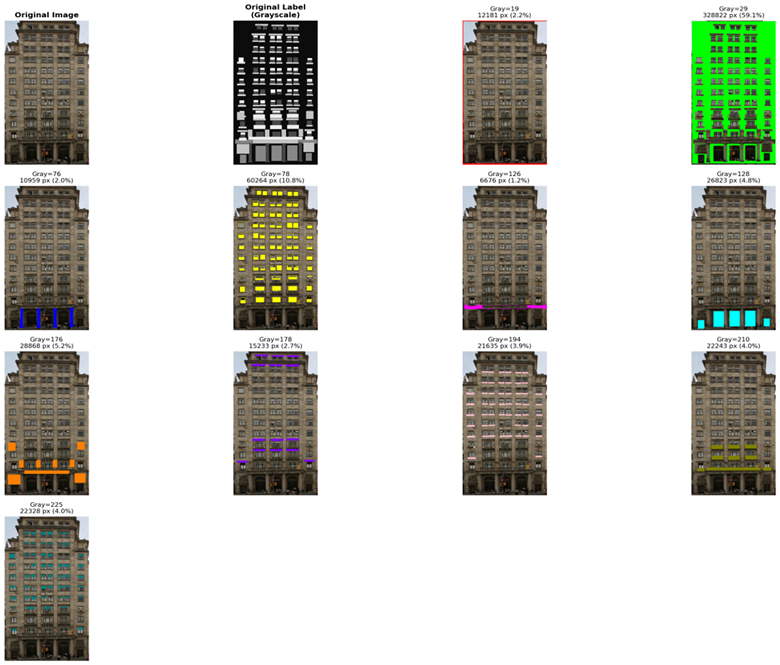
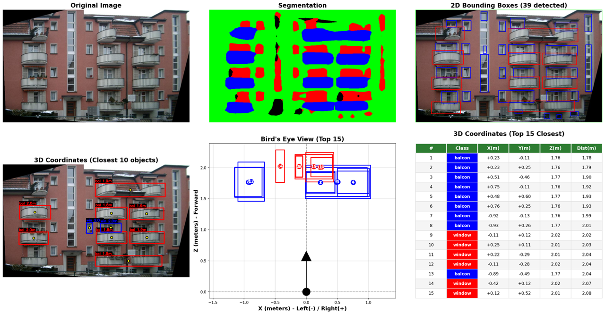
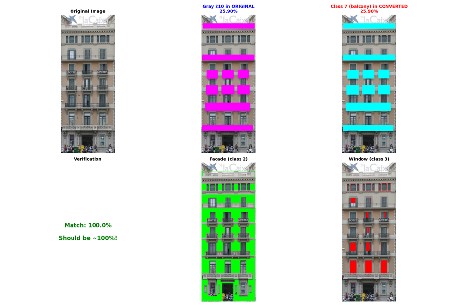
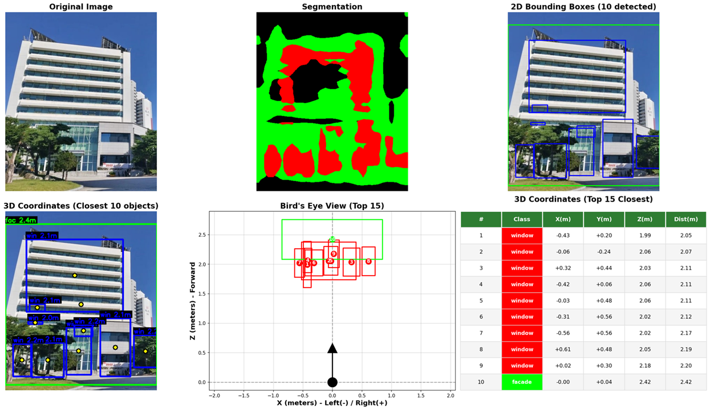
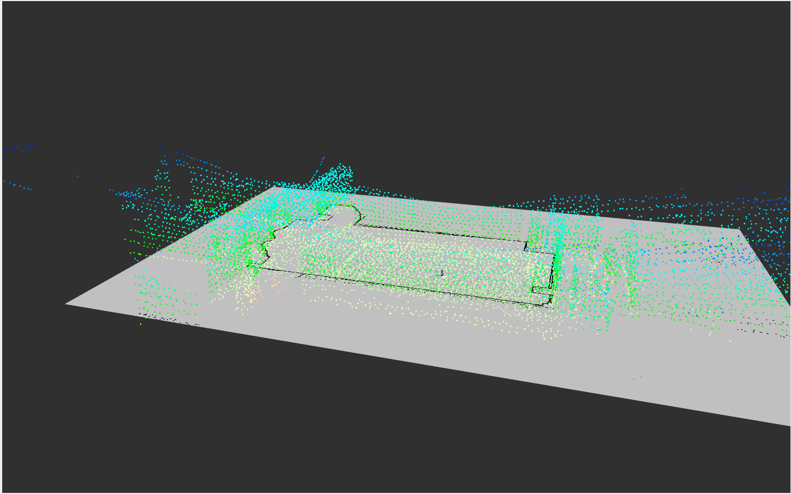
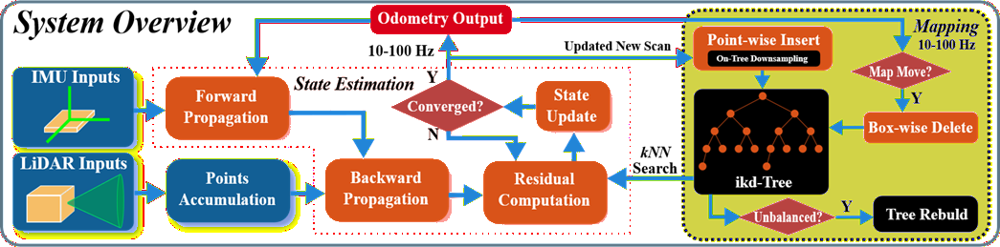
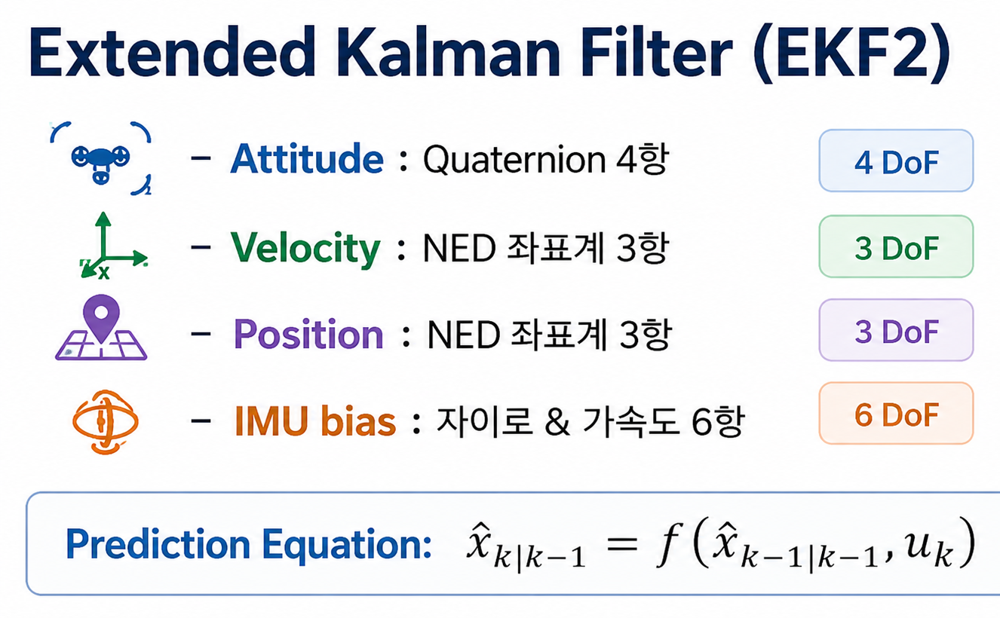

# CO-Paint UGV System

CO-Paint UGV System은 건물 외벽 도색 자동화를 위해 UGV, UAV, LiDAR, 카메라, GCS를 ROS 2 기반으로 연결하는 지상 제어 시스템입니다. 이 레포지토리는 CO-Paint 전체 시스템에서 **메인 제어 서버**, **GCS Web UI**, **ROS 2 통신 허브**, **텔레메트리/명령 로그 저장소**, **SLAM 및 비전 파이프라인 연동부**를 담당합니다.

프로젝트의 목표는 드론이 외벽을 촬영하고, 비전 모델이 도색 가능 영역과 도색 금지 영역을 분류하며, UGV와 GCS가 센서/제어/로그 데이터를 통합해 안전한 도색 작업을 수행하도록 만드는 것입니다.

## Project Overview

CO-Paint는 드론 단독 운용이 아니라 UGV와 드론을 하나의 로봇 시스템으로 묶어 운용합니다. UGV는 내부 네트워크, 센서 데이터 수집, 착륙 보조, 지상 연산 환경을 제공하고, 드론은 외벽 촬영과 도색 작업을 수행합니다.

이 레포지토리의 중심 역할은 다음과 같습니다.

- GCS PC에서 Web UI, API 서버, rosbridge, PostgreSQL을 실행합니다.
- ROS 2 DDS 네트워크를 통해 GCS, Mini PC, UAV edge 장비를 연결합니다.
- PX4 기반 드론 상태와 위치 데이터를 수신하고 로그로 저장합니다.
- Web UI 명령을 검증한 뒤 드론 제어 노드로 전달합니다.
- 드론/UGV SLAM, 비전 세그멘테이션, 자동 착륙 제어 패키지를 함께 관리합니다.

## System Architecture


| 장치 | 기준 주소 | 역할 |
| --- | --- | --- |
| GCS / Main Desktop | `192.168.53.5` | 메인 제어 서버, Web UI, FastAPI, rosbridge, PostgreSQL, 드론 SLAM 연동 |
| Mini PC | `192.168.53.4` | UGV SLAM 처리 |
| UAV Edge / Raspberry Pi | `192.168.53.2` | 드론 내부 제어 통신 및 PX4 연동 |
| LiDAR Sensors | 내부망 연결 | 드론/UGV 위치 추정과 SLAM 입력 |
| Internal Network | `192.168.53.0/24` | GCS, UGV, UAV edge, 센서 통신망 |

외부 브라우저는 GCS의 nginx Web UI에 접속합니다. nginx는 `/api/` 요청을 FastAPI 서버로 전달하고, `/rosbridge/` 요청을 ROS 2 WebSocket 인터페이스로 전달합니다. FastAPI와 telemetry logger는 PX4 상태, 위치, Web UI 명령, 통신 테스트 로그를 PostgreSQL에 저장합니다.

## Core Features

### GCS Web Control

GCS Web UI는 드론 연결 상태, WebSocket 상태, 위치/자세/배터리 텔레메트리, 목표 좌표 입력, ARM/TAKEOFF/LAND/EMERGENCY 명령을 제공합니다. 브라우저에서 발생한 고수준 명령은 `/web_ui/flight_command`로 발행되고, `web_command_relay` 노드가 이를 검증한 뒤 `/flight_control/mission_cmd`로 전달합니다.

### ROS 2 Communication Hub

CycloneDDS와 rosbridge를 사용해 GCS, Mini PC, UAV edge 간 ROS 2 토픽을 교환합니다. PX4 1.16 계열 메시지(`px4_msgs`)와 표준 ROS 메시지를 함께 사용하며, Web UI와 ROS 2 네트워크 사이의 연결 지점은 GCS의 rosbridge가 담당합니다.

### Telemetry and Command Logging

`server`와 `telemetry_logger`는 rosbridge와 PostgreSQL을 연결합니다. 드론 위치, PX4 vehicle status, Web UI 명령, 네트워크 통신 테스트 메시지를 DB에 저장하고 API로 조회할 수 있습니다.

주요 API는 다음과 같습니다.

| API | 용도 |
| --- | --- |
| `GET /api/health` | 서버와 DB 연결 상태 확인 |
| `GET /api/telemetry` | 최근 드론 위치/상태 로그 조회 |
| `POST /api/command-logs` | Web UI 명령 로그 저장 |
| `GET /api/command-logs` | 명령 로그 조회 |
| `GET /api/topic-test-logs` | ROS 2 통신 테스트 로그 조회 |
| `GET /api/px4-vehicle-status-logs` | PX4 vehicle status 로그 조회 |

### Vision Pipeline

`painting_drone` 패키지는 RGB 이미지에서 외벽 도색 가능 영역과 도색 금지 영역을 분류합니다. ResNet-50 기반 세그멘테이션 결과를 바탕으로 facade, window, balcony, blind 등을 구분하고, BBox 및 목표 오차를 드론 제어 노드로 전달합니다.

| Raw Input | Segmentation / Detection Result |
| --- | --- |
|  |  |
|  |  |

주요 토픽 흐름은 다음과 같습니다.

```text
/camera/rgb/image_raw
  -> /vision/segmentation
  -> /vision/bboxes_2d
  -> /vision/target_error
  -> /painting/start_area
```

### SLAM and Localization

GCS와 Mini PC는 LiDAR 기반 SLAM 및 위치 추정 결과를 ROS 2 네트워크로 공유합니다. `localization_bringup`은 Fast-LIO localization 실행과 odometry bridge를 묶어주고, `odometry_bridge`는 SLAM odometry를 PX4에서 사용할 수 있는 형태로 변환하는 역할을 합니다.

| SLAM Map | Fast-LIO / Localization |
| --- | --- |
|  |  |



### Auto Landing Support

`auto_landing_ctrl` 패키지는 UGV 상단 카메라로 드론 하단 ArUco 마커를 추적합니다. 자동 착륙 단계에서 마커 중심 오차를 계산하고 `/cmd_vel`을 통해 UGV를 드론 아래로 정렬하는 PID 제어를 수행합니다.

## Runtime Services

`docker-compose.yml`은 GCS에서 필요한 주요 서비스를 하나의 런타임으로 묶습니다.

| Service | 역할 |
| --- | --- |
| `co_paint` | ROS 2 메인 컨테이너, rosbridge, PX4 메시지 연동 |
| `web_ui` | nginx 기반 GCS Web UI와 `/api/`, `/rosbridge/` 프록시 |
| `server` | FastAPI API 서버와 DB 스키마 관리 |
| `postgres` | 텔레메트리, 명령, 통신 테스트 로그 저장 |

주요 접속점은 다음과 같습니다.

| Endpoint | 설명 |
| --- | --- |
| `http://192.168.53.5` | 내부망에서 접속하는 GCS Web UI |
| `http://localhost` | GCS PC 로컬 Web UI |
| `ws://192.168.53.5/rosbridge/` | Web UI용 rosbridge WebSocket |
| `192.168.53.5:5432` | PostgreSQL |
| `192.168.53.5:8888/udp` | Micro XRCE-DDS Agent |

## ROS 2 Interfaces

| Topic | Message | 용도 |
| --- | --- | --- |
| `/web_ui/flight_command` | `std_msgs/msg/String` | Web UI에서 발행하는 고수준 드론 명령 |
| `/flight_control/mission_cmd` | `std_msgs/msg/String` | 검증 후 드론 제어 노드로 전달되는 미션 명령 |
| `/web_ui/flight_command/status` | `std_msgs/msg/String` | Web UI 명령 relay 처리 결과 |
| `/fmu/out/vehicle_local_position` | `px4_msgs/msg/VehicleLocalPosition` | PX4 위치 텔레메트리 |
| `/fmu/out/vehicle_status_v1` | `px4_msgs/msg/VehicleStatus` | PX4 상태 텔레메트리 |
| `/copaint/net_test` | `std_msgs/msg/String` | DDS 통신 및 DB 저장 테스트 |
| `/vision/segmentation` | `sensor_msgs/msg/Image` | 외벽 이미지 세그멘테이션 결과 |
| `/vision/segmentation_colored` | `sensor_msgs/msg/Image` | 컬러 세그멘테이션 시각화 |
| `/vision/bboxes_2d` | `vision_msgs/msg/Detection2DArray` | 도색/비도색 영역 BBox |
| `/vision/target_error` | `geometry_msgs/msg/Point` | 드론 정렬용 목표 오차 |
| `/vision/exclusion_zones` | `std_msgs/msg/String` | 도색 금지 영역 정보 |
| `/painting/start_area` | `std_msgs/msg/String` | 도색 시작 영역 JSON |
| `/cmd_vel` | `geometry_msgs/msg/Twist` | UGV 이동 명령 |
| `/landing_status` | `std_msgs/msg/String` | 자동 착륙 상태 |

## Repository Layout

```text
ugv_system/
├── control_code/src/
│   ├── auto_landing_ctrl/      # ArUco 기반 UGV 자동 착륙 보조
│   ├── localization_bringup/   # Fast-LIO localization 및 odometry bridge 실행
│   ├── painting_drone/         # 외벽 비전 세그멘테이션 파이프라인
│   ├── px4_gui_ctrl/           # PX4 드론 제어, Web UI 명령 relay, 경로 계획
│   └── px4_msgs/               # PX4 uORB 대응 ROS 2 메시지
├── custom_msgs/                # CO-Paint 커스텀 ROS 2 인터페이스
├── docker/
│   ├── co_paint/               # ROS 2 / rosbridge 런타임
│   ├── server/                 # FastAPI + telemetry logger
│   ├── web_ui/                 # GCS Web UI
│   └── postgres/               # DB 초기 스키마
├── middleware/                 # CycloneDDS / DDS profile 설정
├── odometry_bridge/            # SLAM odometry와 PX4 연동 bridge
├── scripts/                    # 네트워크/서비스 점검 스크립트
└── images/README/              # README용 아키텍처, SLAM, 비전 결과 이미지
```

## Technology Stack

- ROS 2 Humble
- PX4 1.16, `px4_msgs`, Micro XRCE-DDS
- CycloneDDS, rosbridge
- Docker Compose, nginx
- FastAPI, PostgreSQL
- OpenCV, ArUco marker tracking
- ResNet-50 기반 외벽 세그멘테이션
- Fast-LIO 기반 LiDAR localization 연동

## Quick Runtime Check

이 README는 프로젝트 소개를 목적으로 하며, 상세 설치 절차보다는 시스템을 이해하는 데 필요한 최소 실행 흐름만 제공합니다.

```bash
cd ~/dev/projects/CO_Paint/ugv_system
cp .env.example .env
docker compose up -d --build
docker compose ps
scripts/check_network.sh
```

GCS Web UI는 GCS PC에서 `http://localhost`, 내부망 장치에서는 `http://192.168.53.5`로 확인합니다. WebSocket은 `ws://192.168.53.5/rosbridge/` 경로를 사용합니다.

네트워크 기준값이 바뀌면 `.env`, `middleware/cyclonedds.xml`, `docker/web_ui/nginx.conf`의 GCS IP와 peer 주소를 함께 맞춰야 합니다.

## Operational Notes

- ROS 2 DDS 통신 기준 도메인은 `ROS_DOMAIN_ID=53`입니다.
- GCS 기준 CycloneDDS interface 주소는 `192.168.53.5`입니다.
- Mini PC와 UAV edge는 같은 `192.168.53.0/24` 내부망에 있어야 합니다.
- ROS 2 DDS UDP, Web UI, rosbridge, FastAPI, PostgreSQL, Micro XRCE-DDS 포트가 방화벽에서 허용되어야 합니다.
- `/copaint/net_test`는 DDS 통신과 DB 저장 경로를 함께 확인하기 위한 테스트 토픽입니다.

## Project Status

현재 시스템은 UGV, UAV edge, GCS를 내부망으로 연결해 드론 제어, 텔레메트리 로깅, SLAM/비전 파이프라인, 자동 착륙 보조 기능을 통합하는 개발 단계입니다. README는 레포지토리의 목적과 구조를 설명하는 소개 문서이며, 장비별 상세 세팅과 현장 운용 절차는 환경에 맞춰 별도 운영 문서로 관리하는 것을 권장합니다.
